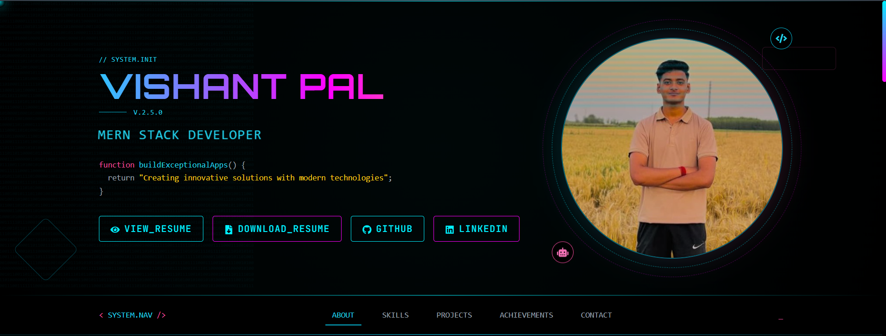
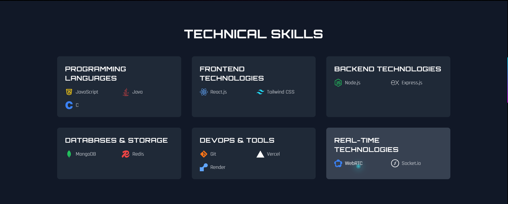
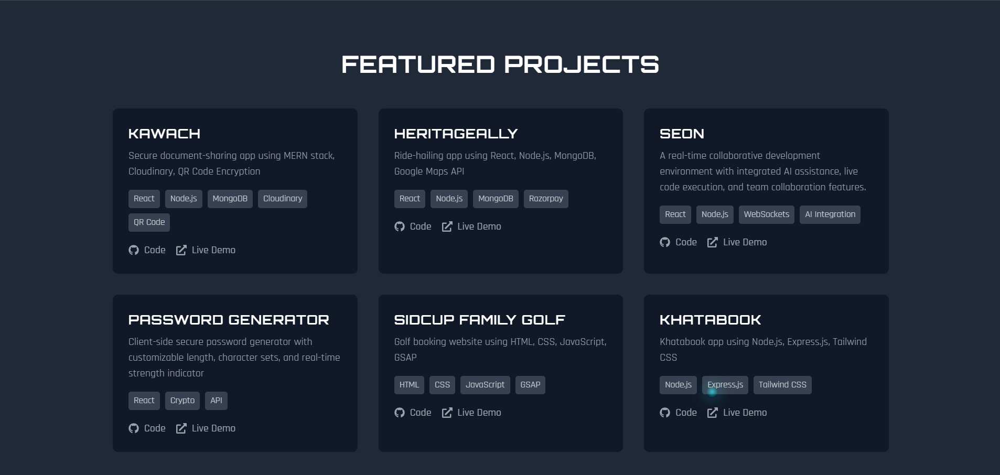
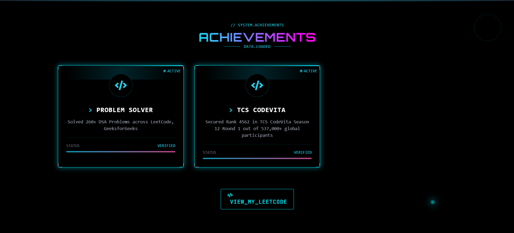
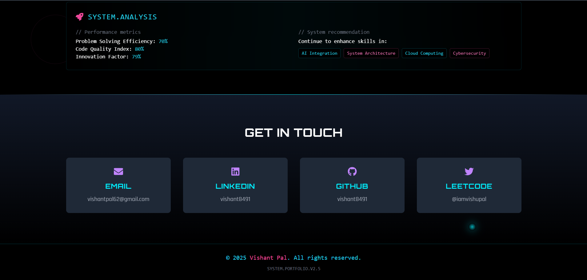

# 🌐 My Portfolio

A modern and responsive personal portfolio website built with React.js to showcase my skills, projects, education, and contact information. The portfolio is designed with a clean UI, smooth user experience, and responsive layout for all devices.

## 🚀 Live Demo

[https://your-portfolio-link.vercel.app](https://password-generator-brown-iota.vercel.app/)

## ✨ Features

- Responsive design for desktop, tablet, and mobile
- Modern and clean user interface
- About Me section
- Skills showcase
- Projects section with live demo and GitHub links
- Education section
- Contact form
- Smooth scrolling and animations
- Fast performance with Vite

## 🛠️ Tech Stack

- React.js
- JavaScript (ES6+)
- HTML5
- CSS3
- Vite

## 📁 Project Structure

```
MyPortfolio/
│── public/
│── src/
│   ├── assets/
│   ├── components/
│   ├── pages/
│   ├── App.jsx
│   ├── main.jsx
│── package.json
│── vite.config.js
```

## ⚙️ Installation

Clone the repository
```bash
git clone https://github.com/vishant8491/MyPortfolio.git
```

Go to the project directory
```bash
cd MyPortfolio
```

Install dependencies
```bash
npm install
```

Start the development server
```bash
npm run dev
```

Build for production
```bash
npm run build
```

Preview production build
```bash
npm run preview
```

## 📸 Screenshots

### Hero Section


### About Me


### Technical Skills


### Featured Projects


### Achievements


### Get In Touch


## 📬 Contact

**Vishant Pal**
📧 Email: vishantpal62@gmail.com
🔗 LinkedIn: [https://www.linkedin.com/in/vishant-pal](https://www.linkedin.com/in/vishant-pal-42a9a9293/)
💻 GitHub: https://github.com/vishant8491

## ⭐ Support

If you like this project, don't forget to give it a ⭐ on GitHub.
